[;Scalable+%7C+Robust+%7C+Efficient)](https://git.io/typing-svg)

---

## 📖 About Me

**A Backend Developer passionate about Node.js & Java**

🔭 Built <b><a href="https://vetcrack.com">VetCrack.com</a></b> — comprehensive full-stack veterinary knowledge & education platform 
🔭 Currently building APIs & backend services with Node.js and Java 
🌱 Exploring microservices, system design & distributed systems 
⚡ Love crafting REST APIs, GraphQL, and event-driven architectures 
🎯 Goal: Build scalable, robust backend systems that power great products 
💬 Ask me about Node.js, Java, Spring Boot, databases, Docker 
☕ Powered by curiosity and lots of coffee

---

## 🛠️ Tech Stack

**Languages**

**Frontend**

**Backend & Frameworks**

**Databases**

**DevOps & Tools**

---

## 📊 GitHub Analytics

---

## 📌 Projects

| Project | Description | Stack |
|---------|-------------|-------|
| [**VetCrack**](https://vetcrack.com) | Comprehensive full-stack veterinary knowledge & education platform. Features: course management, knowledge base, AI chat assistant (Groq), tests & MCQs, notes system, medicine database, payment integration (Razorpay), blog platform, admin dashboard, Firebase auth, credit system, SEO & analytics, full-text search | Node.js, Express, React, TypeScript, Vite, Firebase, Groq, Razorpay, PostgreSQL, MongoDB |
| [**Tinylite**](https://github.com/ayushdixit1-av/tinylite) | Redis-compatible in-memory KV store from scratch — RESP protocol, async TCP server, TTL-based expiration, AOF persistence, pub/sub messaging | Python |
| [**OS3C**](https://github.com/ayushdixit1-av/os3c) | Open Source Security Command Center — browser dashboard orchestrating Nmap, Nuclei, Subfinder, Amass, Httpx, Katana for automated recon & scanning | Python, Docker |

---

## 🐍 Contribution Graph

---

## 🌐 Connect with Me

---

---

