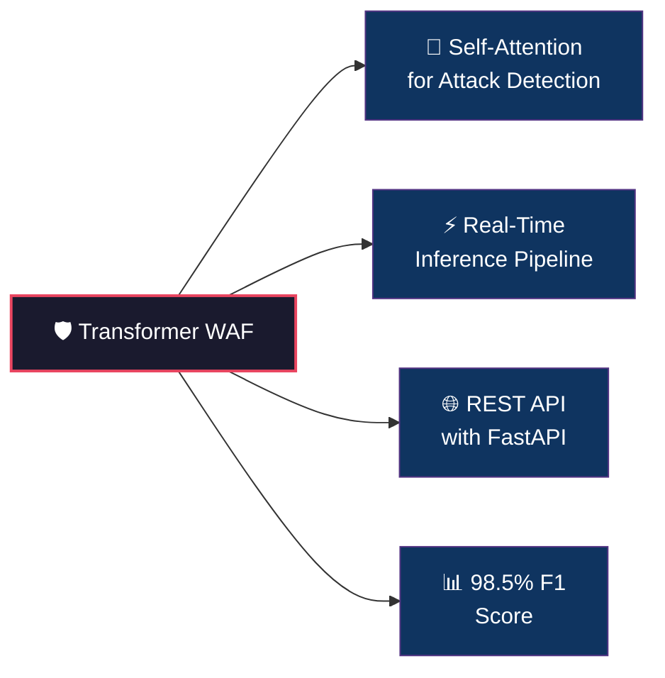

# Hey, I'm Ayush Dixit 👋

### `Computer Science Student | ML Engineer | Security Researcher`

---

**Building intelligent systems that protect the web.**

Currently working on **Transformer-based security models** and **end-to-end ML pipelines**.

---

### 🔥 Featured Project

```mermaid
flowchart LR
    A["🛡️ Transformer WAF"] --> B["🧠 Self-Attention<br/>for Attack Detection"]
    A --> C["⚡ Real-Time<br/>Inference Pipeline"]
    A --> D["🌐 REST API<br/>with FastAPI"]
    A --> E["📊 98.5% F1<br/>Score"]

    style A fill:#1a1a2e,stroke:#e94560,color:#fff,stroke-width:2px
    style B fill:#0f3460,stroke:#533483,color:#fff
    style C fill:#0f3460,stroke:#533483,color:#fff
    style D fill:#0f3460,stroke:#533483,color:#fff
    style E fill:#0f3460,stroke:#533483,color:#fff
```

> **Transformer-based End-to-End Web Application Firewall (WAF) Pipeline** — Deep learning-powered threat detection for SQL Injection, XSS, CSRF, Path Traversal, and Command Injection attacks. Built with PyTorch, BPE tokenization, and a production-ready inference API.

[**View Project →**](https://github.com/ayushdixit1-av/Transformer-based-End-to-End-Web-Application-Firewall-WAF-Pipeline)

---

### 🛠️ Tech Stack

---

### 📊 GitHub Stats

---

### 🔍 What I'm Working On

```mermaid
timeline
    title Development Roadmap
    section Phase 1 : Data Pipeline
        CICIDS Dataset Loader : BPE Tokenizer : HTTP Preprocessor
    section Phase 2 : Core Model
        Transformer Encoder : Classification Head : Training Loop
    section Phase 3 : API & Deploy
        FastAPI Inference : Docker Container : K8s Ready
    section Phase 4 : Evaluation
        Per-class Metrics : Attention Viz : Benchmark vs Rule-Based WAF
```

---

### 📫 Get in Touch

---

*⚡ "The best firewall is the one that understands the attack."*

