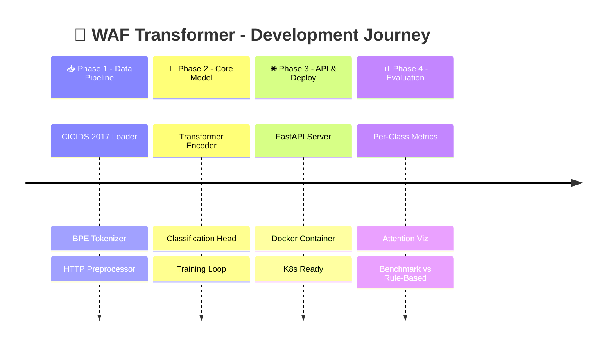

<div align="center">


</div>

---

<div align="center">


</div>

---

### 🧑‍💻 About Me


- 🔧 I'm currently building **ML-powered backend systems**
- 🧠 Currently learning **Deep Learning, LLMs, and System Design**
- 💡 Exploring **Transformer Architectures, MLOps, and Scalable APIs**
- 📫 How to reach me: [](https://linkedin.com/in/) [](mailto:)
- ⚡ Fun fact: *I deploy models before I deploy my mood*

---

### 🏆 Featured Project

<div align="center">

<a href="https://github.com/ayushdixit1-av/Transformer-based-End-to-End-Web-Application-Firewall-WAF-Pipeline">
<div style="border: 2px solid #e94560; border-radius: 12px; padding: 20px; background: linear-gradient(135deg, #0d1117 0%, #1a1a2e 50%, #16213e 100%); box-shadow: 0 4px 15px rgba(233,69,96,0.3);">

```
  ╔══════════════════════════════════════════════════════════════╗
  ║                                                              ║
  ║   🛡️  Transformer-based End-to-End                          ║
  ║       Web Application Firewall (WAF) Pipeline               ║
  ║                                                              ║
  ║   🧠 Self-Attention    ⚡ Real-Time    🌐 REST API          ║
  ║   📊 98.5% F1 Score    🐳 Docker       🔬 Explainable       ║
  ║                                                              ║
  ╚══════════════════════════════════════════════════════════════╝
```

[](https://github.com/ayushdixit1-av/Transformer-based-End-to-End-Web-Application-Firewall-WAF-Pipeline/stargazers)
[](https://github.com/ayushdixit1-av/Transformer-based-End-to-End-Web-Application-Firewall-WAF-Pipeline/network/members)
[](https://github.com/ayushdixit1-av/Transformer-based-End-to-End-Web-Application-Firewall-WAF-Pipeline/issues)
[](https://github.com/ayushdixit1-av/Transformer-based-End-to-End-Web-Application-Firewall-WAF-Pipeline/pulls)

</div>
</a>

</div>

---

### 🛠️ Tech Stack & Tools

<div align="center">

#### Languages


#### ML / AI


#### Web & Backend


#### DevOps & Tools


</div>

---

### 📊 GitHub Analytics

<div align="center">


</div>

<div align="center">


</div>

<div align="center">

[](https://github.com/ashutosh00710/github-readme-activity-graph)

</div>

---

### 🏅 Trophies

<div align="center">

[](https://github.com/ryo-ma/github-profile-trophy)

</div>

---

### 🐍 Contribution Snake

<div align="center">


</div>

---

### 🎯 Roadmap

<div align="center">


```mermaid
timeline
    title 🚀 WAF Transformer - Development Journey
    section 📥 Phase 1 - Data Pipeline
        CICIDS 2017 Loader : BPE Tokenizer : HTTP Preprocessor
    section 🧠 Phase 2 - Core Model
        Transformer Encoder : Classification Head : Training Loop
    section 🌐 Phase 3 - API & Deploy
        FastAPI Server : Docker Container : K8s Ready
    section 📊 Phase 4 - Evaluation
        Per-Class Metrics : Attention Viz : Benchmark vs Rule-Based
```

</div>

---

### 💡 Random Dev Quote

<div align="center">

[](https://github.com/piyushsuthar/github-readme-quotes)

</div>

---

<div align="center">

### 🔥 Visitor Count


---

### 📫 Connect With Me

[](https://linkedin.com/in/)
[](https://twitter.com/)
[](mailto:)
[](https://)

---


</div>
